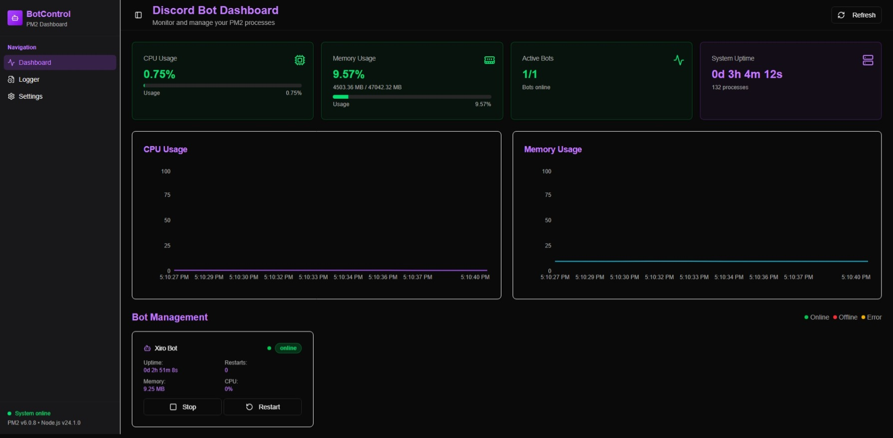

# Discord Bot Dashboard

**A modern, intuitive platform for managing Discord bots with real-time monitoring and powerful customization.**

[](https://nodejs.org/)
[](https://nextjs.org/)
[](https://react.dev/)
[](https://pm2.keymetrics.io/)
[](https://pnpm.io/)
[](LICENSE)
[](https://github.com/xirothedev/discord-bot-dashboard/stargazers)
[](https://github.com/xirothedev/discord-bot-dashboard/issues)



## Features

- **System Monitoring:** Track CPU, RAM, uptime, process count, and bot statuses via PM2.
- **Bot Management:** View status, details, and logs for each bot (online/offline/error).
- **Visual Charts:** Real-time charts for CPU and memory usage.
- **Log Viewer:** Access stdout/stderr logs for each bot directly from the dashboard.
- **UI Settings:** Toggle between Dark/Light mode.
- **RESTful API:** Endpoints for system info and PM2/Node version.

## Tech Stack

- **Next.js 15** (App Router, TypeScript)
- **React 19**
- **TailwindCSS** & **shadcn/ui** (custom UI)
- **Radix UI** (advanced UI components)
- **PM2** (process management)
- **Zod, React Hook Form** (validation & forms)
- **Sonner** (toast notifications)
- **Axios, TanStack React Query** (data fetching)
- **pnpm workspace** support

## Project Structure

```
.
├── src/
│   ├── app/           # Main pages: dashboard, settings, logger, api
│   ├── components/    # Reusable components, UI, sidebar, chart, card, ...
│   ├── hooks/         # Custom React hooks
│   ├── lib/           # Utility libraries (formatters, helpers, ...)
│   ├── data/          # Sample data or configuration
│   └── types/         # TypeScript type definitions
├── public/            # Static assets
├── tailwind.config.ts # TailwindCSS configuration
├── pnpm-workspace.yaml
├── package.json
└── ...
```

## Installation & Usage

1. **Requirements:**
    - Node.js >= 18
    - PM2 installed globally (`npm i -g pm2`)
    - pnpm (`npm i -g pnpm`)

2. **Install dependencies:**

    ```bash
    pnpm install
    ```

3. **Run in development:**

    ```bash
    pnpm dev
    ```

4. **Build for production:**
    ```bash
    pnpm build
    pnpm start
    ```

## API

- `GET /api/monitor`: Get system info, bot statuses, logs, CPU, RAM, uptime, etc.
- `GET /api/version`: Get current PM2 and Node.js versions.
- `GET /api/logs?page=number&limit=number`: Get PM2 logs
- `POST /api/actions`: Start, stop, or restart a PM2 process by id.

    **Payload:**

    ```json
    {
      "action": "start" | "stop" | "restart",
      "pm_id": number
    }
    ```

## Contribution

- Fork the repo, create a new branch, commit your changes, and submit a pull request.
- Please follow code standards, format, and lint before submitting a PR.

## License

MIT © [xirothedev](https://github.com/xirothedev)
